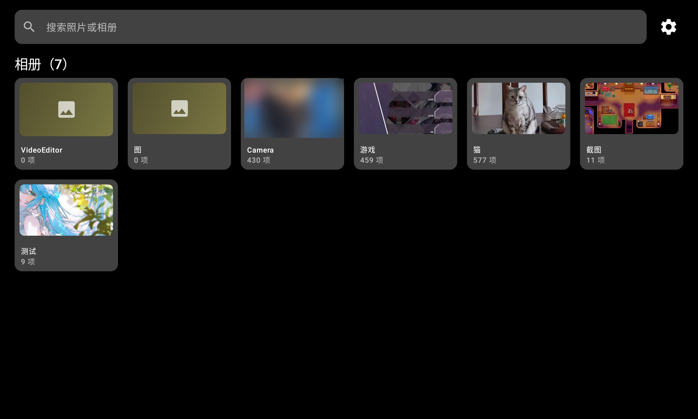
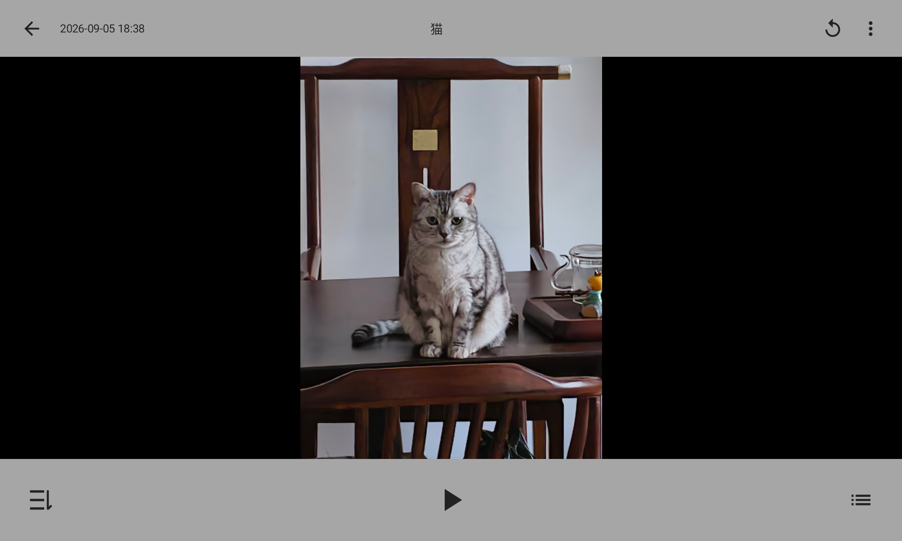
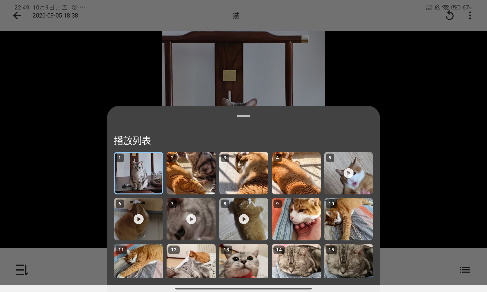
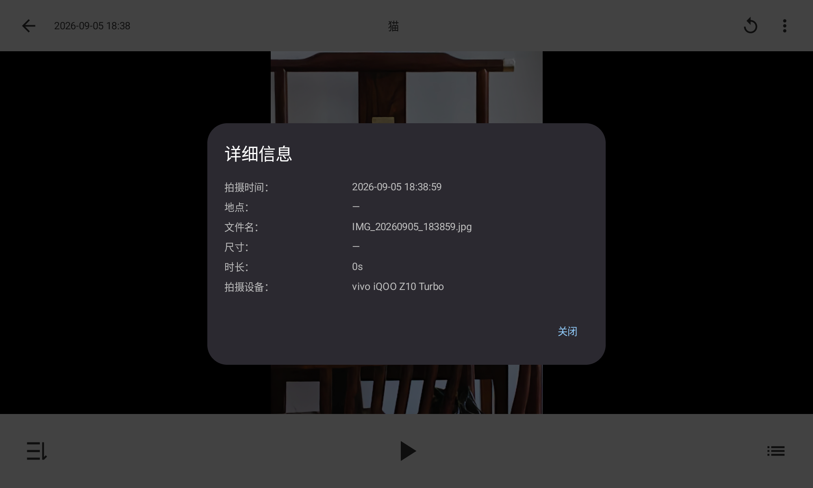
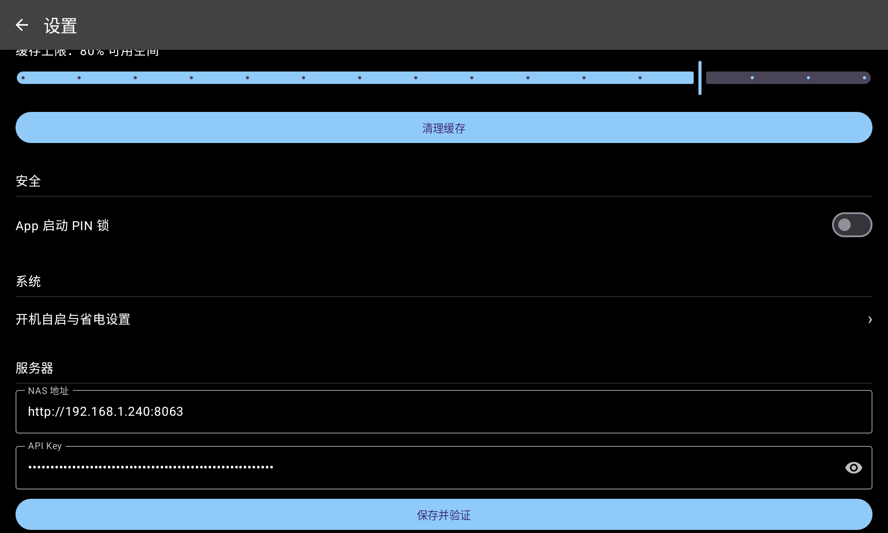
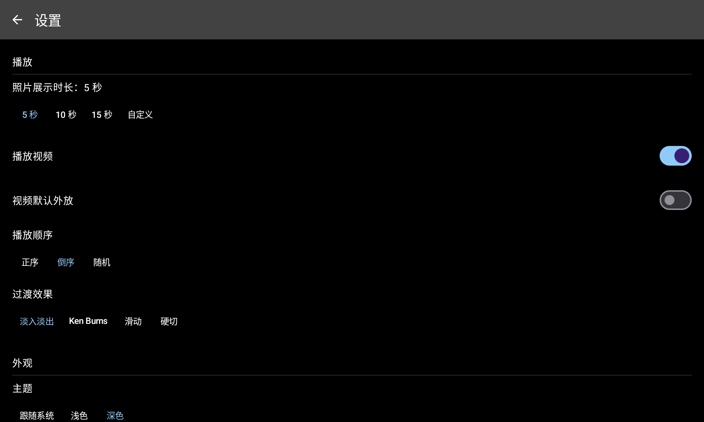

# MT轮播相册 · 使用说明书

把一台闲置的安卓平板变成家里常驻的电子相册：照片和视频自动轮播、开机自启、后台同步、断网也能看。本手册面向**使用者**（不需要懂编程），覆盖从登录到日常使用的全部操作。

> 本 App 是 NAS 相册软件 **MT Photo** 的专用客户端，需要先有一台运行 MT Photo 的服务器（NAS / 电脑 / 盒子均可）。

---

## 目录

1. [开始之前的准备](#1-开始之前的准备)
2. [首次登录](#2-首次登录)
3. [主界面](#3-主界面)
4. [轮播播放](#4-轮播播放)
5. [控制层按钮详解](#5-控制层按钮详解)
6. [播放列表](#6-播放列表)
7. [照片详情](#7-照片详情)
8. [断点续播规则](#8-断点续播规则)
9. [断网了怎么办（离线模式）](#9-断网了怎么办离线模式)
10. [服务器地址变了怎么办](#10-服务器地址变了怎么办)
11. [设置项速查](#11-设置项速查)
12. [常见问题 FAQ](#12-常见问题-faq)
13. [隐私与安全说明](#13-隐私与安全说明)

---

## 1. 开始之前的准备

| 需要什么 | 说明 |
|---|---|
| [MT Photo](https://mtmt.tech) 服务器 | 已在 NAS / 电脑上运行，且**开启了 OpenAPI** |
| 管理员 API Key | 在 MT Photo 网页端「设置 → API」中生成，是一串字符（相当于密码，别外传） |
| 平板 | Android 12 以上，与服务器**同一局域网** |
| 服务器地址 | 形如 `http://192.168.1.240:8063` 的 IP + 端口 |

## 2. 首次登录

1. 打开 App，首次会进入引导页
2. 输入**服务器地址**（如 `http://192.168.1.240:8063`，注意带上 `http://` 和端口）
3. 粘贴 **API Key**
4. 点保存，App 会先验证能否换取登录凭证，成功后自动开始首次同步

同步完成后主界面就会出现相册。之后登录信息加密保存在平板本地，不需要重复登录。

## 3. 主界面

- **相册卡片**：显示相册名和项目数，点卡片直接进入轮播
- **搜索框**：顶部全局搜索照片或相册
- **右上角齿轮**：进入设置
- 下拉可刷新相册列表

## 4. 轮播播放

点开相册即开始全屏轮播：

- **照片**按设定时长（默认 5 秒）自动切换，支持 Ken Burns / 淡入淡出 / 滑动 / 硬切四种过渡效果
- **视频**完整播放一遍后自动切下一项，默认静音播放
- **单击屏幕**唤出/隐藏控制层（见下一节）
- 支持**手势左右滑动**直接翻上一张 / 下一张

## 5. 控制层按钮详解

轮播中单击屏幕，顶部和底部会出现控制层：

**顶栏（从左到右）**

| 按钮 | 作用 |
|---|---|
| ← 返回 | 退出轮播回到主界面 |
| 时间 / 地点 | 当前照片的拍摄时间和 GPS 地点 |
| 相册名 | 当前播放的相册 |
| 🔄 从头开始 | 立刻跳回**第一张**重新开始播放 |
| ⋮ 更多 | 打开当前照片的详情 |

**底栏（从左到右）**

| 按钮 | 作用 |
|---|---|
| 播放模式 | 在 正序 → 倒序 → 随机 之间循环切换 |
| ▶ / ⏸ | 播放 / 暂停 |
| ☰ 播放列表 | 打开当前相册的播放列表 |

播放**视频**时，控制层底部还会出现**进度条**，可以拖动跳转到视频任意位置，旁边显示已播放 / 总时长。

## 6. 播放列表

点底栏 ☰ 打开：

- 缩略图网格展示全部项目，左上角**序号**表示播放顺序，**视频项带 ▶ 角标**
- **当前正在播放的一项有高亮边框**，打开时自动滚动到该位置
- 点任意一项立即跳过去播放
- 支持多选**删除**（只从播放列表移除，不删服务器文件）与**拖动排序**

## 7. 照片详情

点控制层右上角 ⋮，查看当前照片的拍摄时间、地点、文件名、尺寸、时长和拍摄设备。

## 8. 断点续播规则

- 在相册 A 播到第 N 张后退出，**重新打开 A 会从第 N 张继续**
- 若中间打开过相册 B，**再打开 A 时从头开始**（只记住最近播放的相册的进度）
- 开机自启时同样恢复上次播放的相册和位置

## 9. 断网了怎么办（离线模式）

服务器连不上时（比如路由器重启、网线被拔），界面顶部会出现红色横幅：

> **无法连接服务器，正在显示离线内容** ［重试］

此时：

- 相册列表和**看过的照片**依然正常显示（走本地缓存）
- 没看过的照片、视频无法加载
- 网络恢复后点「重试」或等待自动同步，横幅自动消失

## 10. 服务器地址变了怎么办

家里路由器给电脑/NAS 分配的 IP 可能变化（如 `.239` 变成 `.240`），表现为封面空白、顶部出现离线横幅。处理方法：

1. 在电脑上查一下服务器的新 IP（或到路由器后台做 **IP-MAC 绑定**一劳永逸）
2. App 内打开 **设置 → 服务器**
3. 把 NAS 地址改成新 IP，API Key 不用动
4. 点「**保存并验证**」——验证通过会提示成功并自动重新同步

改地址**不会丢失已缓存的离线照片**（缓存与地址解耦）；若验证失败会显示服务器返回的具体原因并自动还原旧配置，不用担心改坏。

## 11. 设置项速查

| 区块 | 设置项 | 说明 |
|---|---|---|
| 播放 | 照片展示时长 | 5 / 10 / 15 秒或自定义 |
| 播放 | 播放视频 | 关闭后纯照片轮播 |
| 播放 | 视频默认外放 | 开启后视频带声音（默认静音） |
| 播放 | 播放顺序 | 正序 / 倒序 / 随机 |
| 播放 | 过渡效果 | 淡入淡出 / Ken Burns / 滑动 / 硬切 |
| 外观 | 主题 | 跟随系统 / 浅色 / 深色 |
| 同步与缓存 | 后台同步频率 | 关闭 / 15 分钟 / 30 分钟 / 1 小时 / 仅手动 |
| 同步与缓存 | 缓存上限 | 默认可用空间的 80%，超出自动清理最旧缓存 |
| 同步与缓存 | 清理缓存 | 一键清空离线缓存 |
| 安全 | App 启动 PIN 锁 | 冷启动需要输 PIN（防误触/防翻看） |
| 系统 | 开机自启与省电设置 | 国产 ROM（小米等）自启动引导 |
| 服务器 | NAS 地址 / API Key | 随时修改并验证，见[第 10 节](#10-服务器地址变了怎么办) |

## 12. 常见问题 FAQ

**Q：封面全空白，顶部有红色横幅？**
服务器地址变了或服务器没开机。按第 10 节改地址；确认服务器在运行。

**Q：提示「API Key 无效或已过期」？**
到 MT Photo 网页端重新生成 API Key，再到设置 → 服务器里替换。

**Q：大视频要等几秒才播？**
视频走服务器在线转码，第一次起播有转码等待，属正常现象；播放失败会自动重试一次。

**Q：断网后有的照片能看有的不能？**
只有**看过的**照片进了本地缓存。想让常用相册离线可看，先连网翻一遍。

**Q：缓存会不会被系统相册 / 微信扫描到？**
不会。缓存存在 App 私有目录，文件名是哈希值且无图片扩展名，系统相册检测不到，见[隐私说明](#13-隐私与安全说明)。

**Q：换了平板要重新登录吗？**
要。登录信息只存在本机，新设备按第 2 节重新登录一次。

## 13. 隐私与安全说明

1. **API Key 加密存储**在平板本地（Android Keystore 加密），不落明文
2. **离线缓存**在 App 私有目录（`cacheDir/image_cache`）：系统相册、文件管理器、其他 App 均无法读取；文件名是无扩展名的哈希，导出也不会被当图片渲染
3. **PIN 锁**可防止他人拿到平板后翻看相册（仅保护冷启动，轮播运行中不锁）
4. App 不会上传任何数据，所有通信只在平板与你的 MT Photo 服务器之间进行
